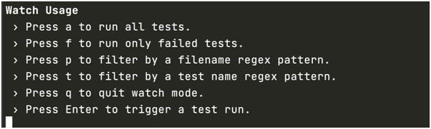

# Basic testing configuration

## Jest

We work with `jest` and `ts-jest` to test our code.

-   Configure: `npx ts-jest config:init`.
-   Help: `npx jest help`.
-   Coverage: `npx jest --coverage`.
-   Verbose: `npx jest --verbose`: Display individual test results with the test suite hierarchy.
-   RunInBand: `npx jest --runInBand`: Alias: `-i`. Run all tests serially in the current process, rather than creating a worker pool of child processes that run tests. This can be useful for debugging.
-   Changed files: `npx jest -o`: Run tests related to changed files based on hg/git (uncommitted files).
-   Watch: `npx jest --watch`: Watch files for changes and rerun tests related to changed files. If you want to re-run all tests when a file has changed, use the `--watchAll` option instead.

    

## VSCode

-   In File/Preferences/Settings search for `auto attach` and change the value for `smart` to activate the debugger.
-   Install `vscode-jest` extension.
