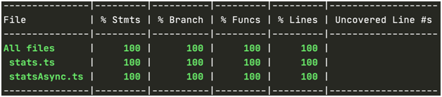

# Class 2

## Tests coverage

The coverage report is a good tool but quantity should never be prioritized over quality.

It may be much more interesting that the core functionality requires greater coverage and that the less important or more subject to change parts require less. We can configure this in the jest.config.js file as follows:

```js
module.exports = {
    preset: "ts-jest",
    testEnvironment: "node",
    verbose: true,
    collectCoverage: true,
    coverageDirectory: "./coverage",
    coverageThreshold: {
        global: {
            statements: 50,
            branches: 50,
            functions: 50,
            lines: 50,
        },
        "./src/utils/": {
            statements: 90,
            branches: 90,
            functions: 90,
            lines: 90,
        },
    },
};
```



The first column, stmts (statements), tells us the number of statements covered. There could be more than one statement on a line in our code, this is something that we should of course avoid. The second column, branch, refers to the percentage where there is a branch due to some conditional statement (if-else, switch or ternary). The next column refers to the percentage of tested functions of a file. And finally, we have the percentage of tested lines of a file.

## Test maintenance

Some good practices:

-   The tests do not break down in a single day, they decay day by day like normal code. Test code should not be considered of lesser importance than production code.
-   The tests should not change the result if the implementation has not changed.
-   Tests must be refactored to make them sustainable
-   There are several acronyms that can help us remember the desirable characteristics of the tests. One of them is FIRST (Fast, Independent, Repeatable, Self-validated and Timely).
-   When practicing TDD, think about all possible test cases and order them so that the code can increase naturally.
